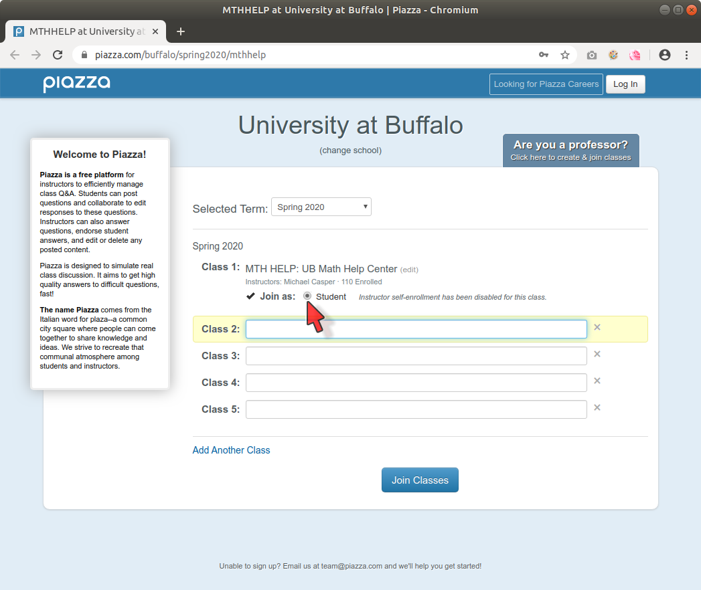
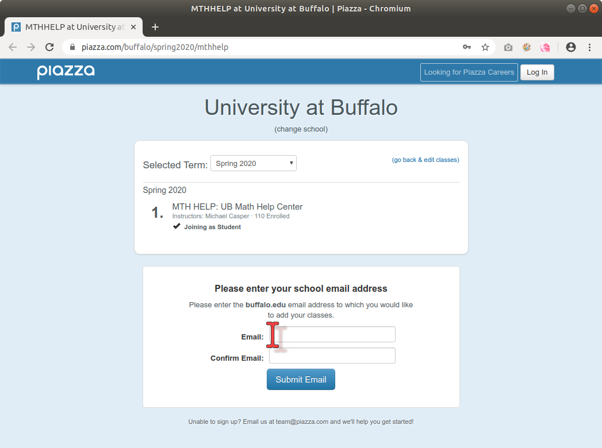
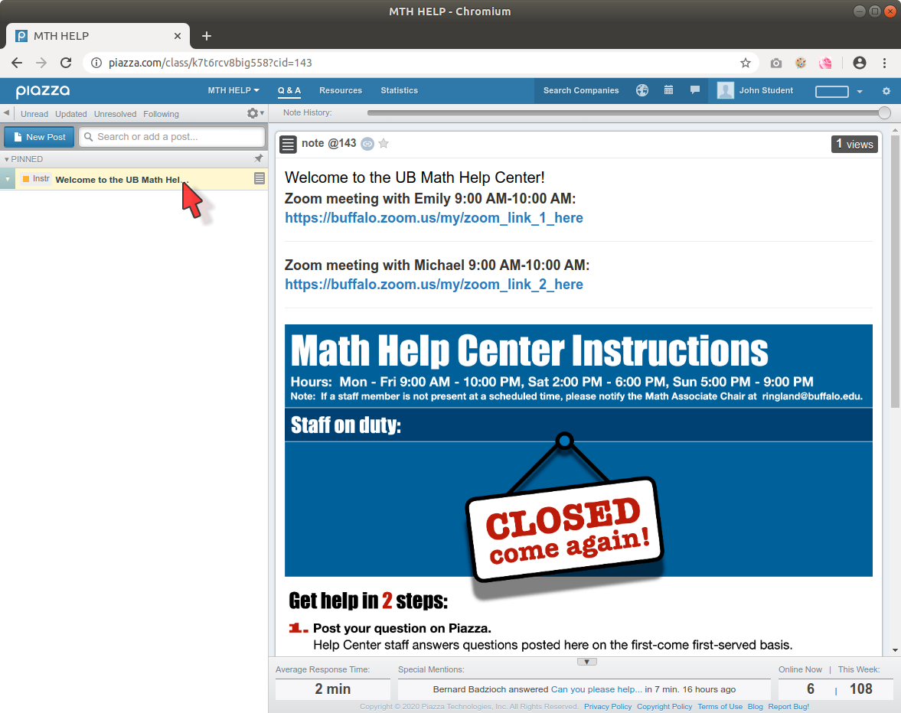

UB Math Help Center
=====================

The Help Center is accessed via `this discussion forum on Piazza <https://piazza.com/buffalo/spring2020/mthhelp>`__.

Join the class MTH HELP on Piazza
--------------------------------------

On your *first* visit, join the class MTH HELP as follows. 
Click the link above and click the "Student" button.
Then click "Join Classes".

Then enter your UB email address and click "Submit Email"

This only needs to be done once. On subsequent visits, you will only
need to log in to Piazza, and the MTH HELP forum will be available among your classes:

-----

The Welcome post
-----------------

Each time you visit the MTH HELP Piazza forum, begin by clicking on the Welcome post, 
which is always "pinned" at the top of the list of posts
on the left side of the screen. 

When the Help Center is open, it will look something like what's shown below,
with information about the staff who are currently on duty,
and links to the Zoom meetings in which they will help you:

.. image:: mth_help_piazza_welcome_1.png
	:height: 500px

Next, you should make a post on the forum, describing the question you have.
By making this post you effectively claim your place in line. Visitors are served
on a first-come first-served basis.

Zoom
-----

Zoom meetings are the primary means of communicating with the Help Center staff.

If you have not used Zoom before, go to `<https://buffalo.zoom.us>`__ and configure your account,
and download the app.

Thereafter, you should be able to join a meeting simply 
by clicking on a Zoom meeting link in the Piazza Welcome post.

-------

When the Help Center is closed, the Piazza Welcome post will look something like this:

